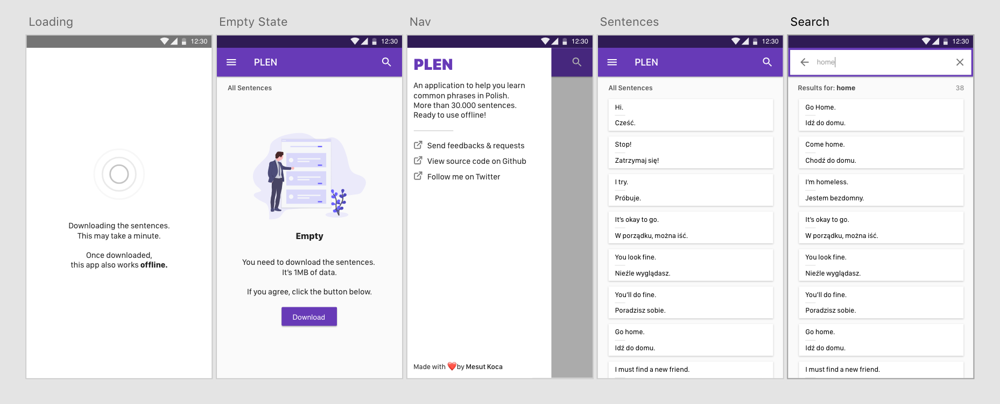

# PLEN

An application to help you learn common phrases in Polish. More than 30.000 sentences. Ready to use offline! Built with [Vue](https://vuejs.org/) and [Tailwindcss](https://tailwindcss.com/).

Live: [plen.netlify.com](https://plen.netlify.com)



## About Project

I made this app when i was learning Polish. So...

It uses IndexedDB and fuzzy searching (searching might be slow if you have a low-end device).

It has some tests in `tests` folder

## Project setup

```
yarn
```

### Compiles and hot-reloads for development

```
yarn run serve
```

### Compiles and minifies for production

```
yarn run build
```

### Lints and fixes files

```
yarn run lint
```

### Run the unit tests

```
yarn run test:unit
```

## Dependencies

- [dexie](https://ghub.io/dexie): A Minimalistic Wrapper for IndexedDB
- [fuzzysort](https://ghub.io/fuzzysort): Fast SublimeText-like fuzzy search for JavaScript
- [tailwindcss](https://ghub.io/tailwindcss): A utility-first CSS framework for rapidly building custom user interfaces.
- [vue](https://ghub.io/vue): A progressive, incrementally-adoptable JavaScript framework for building UI on the web.
- [vuex](https://ghub.io/vuex): state management for Vue.js
- [workerize-loader](https://ghub.io/workerize-loader): Automatically move a module into a Web Worker (Webpack loader)

## Licence

[MIT](https://opensource.org/licenses/MIT) © [Mesut Koca](https://mesutkoca.com)
